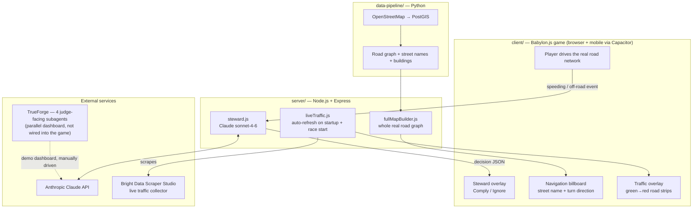

# Hometown Grand Prix — AI Race Governance System

A 3D street racing game built on **real OpenStreetMap roads** (Downtown San Jose / SJSU), governed
by **live AI agents** that enforce traffic rules, guide the driver in real time, and pull in live
traffic data — built for the **Agent Harness Hackathon** (WeMakeDevs, Aug 29 2026, San Francisco).

> Started as a local driving-game MVP. Today's hackathon build adds an AI Race Steward, live
> traffic scraping, free-roam driving on the entire real road network, and a judge-facing
> multi-agent dashboard.

**[View the judge-facing project overview →](https://claude.ai/code/artifact/7102bfd3-09f8-4eba-bea9-e6439f710735)**
— a one-page visual summary of the 4 agents, what's live, and how each prize track is targeted.

<!--
  Add real screenshots/GIFs here once you have them, e.g.:
  
  
  
-->

---

## What this repo is, in one picture



---

## The 4 AI agents

| # | Agent | Where it runs | What it does |
|---|-------|----------------|--------------|
| 1 | **Traffic Steward** | In-game, automatic (`server/steward.js`) | Watches speed vs. the real OSM-derived speed limit; issues a warning + optional time penalty, gated on player approval (Comply/Ignore) |
| 2 | **Route Navigator** | In-game (`client/src/navigationHud.js`) + TrueForge demo agent | Shows the next real street name and turn direction as you drive; TrueForge's version reasons about rerouting scenarios live for judges |
| 3 | **Safety Car Agent** | TrueForge demo agent | Given a collision/near-miss description, decides safety-car deploy + pit-stop recommendation |
| 4 | **Race Commentator** | TrueForge demo agent | Turns the other 3 agents' updates into one dramatic, TV-style commentary line |

Agents 1–2's in-game behavior is **fully automatic** — no human triggers it while playing.
Agents 3–4 (and the TrueForge-hosted view of 1–2) are a **parallel demo dashboard**: during the
hackathon demo, a real in-game event is narrated live and the same event is typed into TrueForge
so judges watch the subagent + connector + approval pattern reason through it. See
[`docs/trueforge-agent-prompts.md`](docs/trueforge-agent-prompts.md) for the exact prompts used.

---

## Tech stack

- **Client:** Babylon.js (WebGL 3D) + vanilla JavaScript, bundled with Vite, wrapped for iOS/Android via Capacitor
- **Server:** Node.js + Express
- **Data:** Python pipeline pulling real OpenStreetMap data into PostGIS
- **Database:** PostgreSQL + PostGIS
- **AI:** Anthropic Claude (`claude-sonnet-4-6`) for the in-game steward; TrueForge (OpenAI-backed) for the judge-facing dashboard
- **Live data:** Bright Data Scraper Studio for live traffic congestion

## Repo structure

```
hometown-grand-prix/
├── client/          → Babylon.js game (web + Capacitor mobile wrapper)
├── server/          → Express API: world data, race routes, AI steward, live traffic
├── data-pipeline/   → one-time Python scripts: OSM → PostGIS → road graph/buildings JSON
├── docs/            → Bright Data scraper config, TrueForge prompts, schema reference
└── CLAUDE.md        → full hackathon build plan and rules this repo was built against
```

## What was built for this hackathon (today)

1. **AI Race Steward** — `server/steward.js` + `POST /api/steward`. Called automatically from the
   game's render loop (`client/src/main.js`) whenever the car speeds (>10% over the real,
   OSM-class-derived limit) or drifts off-road, with a 10s cooldown per event type. The player
   must Comply or Ignore in the overlay; only Ignore applies a time penalty — the agent never acts
   unilaterally.
2. **Free-roam driving on the whole real road network** — previously the game generated one fixed
   corridor between two points; now `server/world/fullMapBuilder.js` serves the entire real road
   graph plus real intersections, so a player who knows the streets can pick their own route.
3. **Real street names + turn-by-turn navigation billboard** — `data-pipeline/03_build_road_graph.py`
   extracts OSM's real `name` column (98% coverage on this map); `client/src/navigationHud.js`
   shows the next intersection's street name and whether to go left/right/straight.
4. **Live traffic overlay, fully automatic** — a real Bright Data Scraper Studio collector
   (`c_mtewpzd4ncsji847m`) is triggered server-side on every server start and every race start,
   with no manual step. Output is matched to real road segments and rendered as a green→red
   colored strip on the affected road. Full writeup, including the honest self-healing result:
   [`docs/bright-data-scraper.md`](docs/bright-data-scraper.md).
5. **Driving feel** — progressive acceleration, smoothed steering, a speedometer, and a
   predictive speed-limit readout in the HUD.
6. **TrueForge judge dashboard** — 4 subagents configured with connectors (`exa`,
   `parallel-web`) as a second screen for the live demo.

## Qodo Code Review Evidence

Qodo is connected to this repository with automatic PR review enabled (no manual trigger per
PR). Representative merged PR:
[#1 — Rewrite README as full hackathon overview](https://github.com/karthikshetty-1629/hometown-grand-prix/pull/1).
Qodo reviewed the diff automatically and reported 0 bugs, 0 rule violations, and 0 requirement
gaps, along with its own auto-generated architecture summary of the change; the PR was merged
as-is since no fixes were needed.

## Prerequisites (install these once)

- **Docker Desktop** — runs the local PostgreSQL + PostGIS database in a container
- **Node.js** (v18+) — runs the server and the client dev build
- **Python 3** (3.10+) — runs the data pipeline scripts
- **osmium-tool** — clips the big California map file down to just our neighborhood
  - macOS: `brew install osmium-tool`
- **osm2pgsql** — imports the clipped map data into PostGIS
  - macOS: `brew install osm2pgsql`
- An `.env` file at the repo root with `ANTHROPIC_API_KEY` and `BRIGHT_DATA_API_KEY` (never
  committed — see `.gitignore`)

## First-time setup, in order

```bash
# 1. Start the local database (runs on host port 5433, not 5432, in case you already
#    have another Postgres running locally)
docker compose up -d

# 2. Run the data pipeline once, to pull the SJSU area's roads + buildings
cd data-pipeline
pip install -r requirements.txt
bash 01_download_extract.sh      # ~1GB one-time download from Geofabrik
bash 02_import_to_postgis.sh
python3 03_build_road_graph.py
python3 04_extract_buildings.py
python3 05_extract_footpaths.py   # sidewalks/paths, rendered as a placement-check reference
python3 06_generate_track.py      # generates one default loop (fallback track)
python3 07_export_chunk.py        # exports that default loop as a playable chunk
python3 08_copy_world_data.py     # publishes the road network + buildings + footpaths for live route picking

# 3. Start the local API server
cd ../server
npm install
node index.js
# -> http://localhost:3001

# 4. Start the client (in a new terminal)
cd ../client
npm install
npm run dev
# -> http://localhost:5173
```

Open the client URL in a browser. Pick a start point and an end point anywhere on the real street
network — the game validates a real route exists between them, then lets you drive there via
whatever streets you choose. Drive it, finish, and your run is saved as a ghost; pick the same two
points again to race against it.

## Demo flow (what we show judges)

1. Drive normally on real San Jose streets — buildings, intersections, and street names are real.
2. Speed past the limit — the Traffic Steward overlay appears with a live Claude-generated
   warning; choose Ignore to show the penalty apply, or Comply to show it acknowledged.
3. Point out the navigation billboard calling the next real street and turn direction.
4. Point out the live traffic overlay (thin/green vs. thick/red) sourced from the Bright Data
   collector, refreshed automatically with no manual trigger.
5. Switch to the TrueForge dashboard and narrate the same event live, showing the subagent +
   connector + human-approval pattern judges are scoring on.

## Explicitly out of scope for this version

- Live/real-time multiplayer
- Photorealistic or hand-modeled buildings
- Multiple cities/neighborhoods
- NPC traffic, pedestrians, elevation
- Cloud storage (placeholder left in `server/storage/localStorage.js` for swapping in later)
- TrueForge wired directly into live gameplay (kept as a manually-driven parallel demo — see
  [`docs/trueforge-agent-prompts.md`](docs/trueforge-agent-prompts.md))
